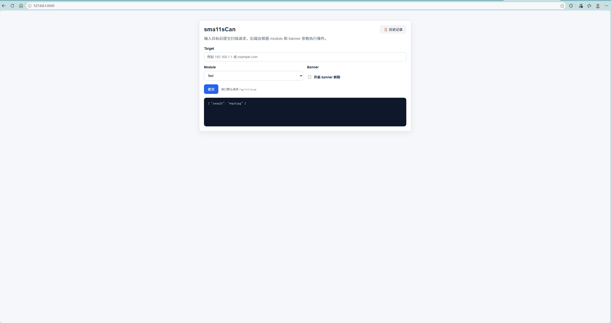
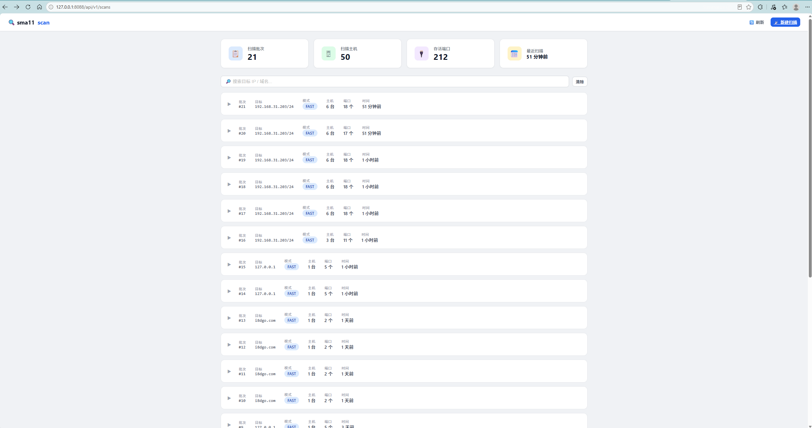

# sma11sCan

基于 Go 开发的高并发端口扫描 + 资产探测工具。支持端口扫描、Banner/指纹识别、子域名收集、CDN 检测与源站 IP 找回，同时提供 Web API 服务。

## 命令行使用

### 参数

| 参数        | 默认值           | 说明                                                           |
| ----------- | ---------------- | -------------------------------------------------------------- |
| `-ip`       | (必填)           | 目标 IP / 域名 / CIDR 网段                                     |
| `-module`   | `fast`           | 扫描模式：`fast`(常用端口) / `top`(Top 1000) / `full`(1-65535) |
| `-banner`   | `false`          | 是否抓取 Banner 并进行服务与 Web 指纹识别                      |
| `-domain`   | -                | 目标域名，收集子域名                                           |
| `-wordlist` | `subdomains.txt` | 子域名字典文件路径                                             |
| `-noscan`   | `false`          | 只收集子域名，不扫描端口                                       |

### 示例

```bash
# Fast 模式扫常用端口
sma11scan -ip 192.168.1.1

# Top 1000 端口 + Banner 抓取 + 指纹识别
sma11scan -ip 192.168.1.1 -module top -banner

# 全端口扫描（1-65535）
sma11scan -ip 192.168.1.1 -module full

# 域名扫描（自动 CDN 检测 + 源站找回）
sma11scan -ip example.com -module top -banner

# CIDR 网段扫描
sma11scan -ip 192.168.1.0/24 -banner

# 子域名收集，不扫描端口
sma11scan -domain baidu.com -noscan

# 子域名收集 + 端口扫描
sma11scan -domain baidu.com -module top -banner
```

### 输出示例

```
存活的端口：
192.168.31.1:80     [HTTP   ] Nginx 200 OK | Server: nginx/1.12.2 | Title: 小米路由器
192.168.31.219:22   [SSH    ] SSH-2.0-OpenSSH_8.2
192.168.31.202:3306 [MySQL  ] 8.0.43 caching_sha2_password
```

域名扫描时会输出 CDN 检测和源站找回过程：

```
[CNAME] www.example.com.cdn.cloudflare.net.
[CDN] true → Cloudflare
[VirusTotal] 获取到 5 个候选 IP
[Origin IP] 1.2.3.4
存活的端口：
1.2.3.4:80   [HTTP] 200 OK | Server: nginx/1.24.0 | Title: Example Site
```

## Web API 服务

启动后浏览器打开页面，即可发起扫描和查看历史记录。

```bash
# 启动
sma11scan-api

# 浏览器访问 http://localhost:8088
```





### 接口

| 方法 | 路径                 | 说明             |
| ---- | -------------------- | ---------------- |
| GET  | `/`                  | 首页（扫描表单） |
| POST | `/api/v1/scan`       | 发起扫描         |
| GET  | `/api/v1/scans`      | 历史查询页面     |
| GET  | `/api/v1/scans/list` | 扫描历史 JSON    |

POST `/api/v1/scan` 请求体：

```json
{
    "ip": "192.168.1.1",
    "module": "fast",
    "banner": false
}
```

所有接口统一返回 `{"code":0, "message":"success", "data":{...}}`。

### 部署（Nginx + Docker）

生产部署建议前面挂 Nginx，统一入口 + 限流 + Gzip。Docker 方式二选一：

```bash
# 方式 1：直接运行
sma11scan-api                    # 启动 API，监听 :8088
nginx                            # 启动 Nginx 反向代理（80 → 8088）

# 方式 2：Docker
docker build -t sma11scan-api .
docker run -d -p 8088:8088 --name scan-api sma11scan-api
```

> Windows/macOS 上 Docker 受 NAT 限制，仅支持 fast 单 IP 扫描。完整功能请直接运行二进制。

## 功能

**端口扫描** — TCP Connect，三种模式（fast/top/full），Worker Pool 100 并发，支持 CIDR 网段。

**CDN 检测 & 源站找回** — CNAME 匹配 18 家国内外主流 CDN；接入 VirusTotal API 获取历史解析 IP，通过 Title + Favicon 双重验证确认源站，绕过 CDN 直接扫描后端。

**Banner & 指纹** — TCP Banner 抓取并自动清洗；HTTP/HTTPS 探测模拟浏览器请求头，自定义 DialContext + TLS SNI 正确设置；100+ Web 指纹规则（Nginx/Apache/WordPress/Discuz 等），加权评分 + 阈值过滤；50+ Favicon hash 匹配。

**子域名收集** — DNS 字典爆破（50 并发）+ crt.sh 证书透明度日志备选。

**Web API** — Gin 框架，路由分层（router → handler），自定义 Logger/Recovery 中间件，统一 JSON 响应格式，优雅关闭。

## 快速开始

### 环境变量（可选）

| 变量         | 说明                                                       |
| ------------ | ---------------------------------------------------------- |
| `VT_API_KEY` | VirusTotal API Key，用于源站 IP 找回。不设置不影响其他功能 |

```bash
# Windows PowerShell
$env:VT_API_KEY = "your-api-key"

# Linux / macOS
export VT_API_KEY="your-api-key"
```

### 从源码运行

```bash
git clone https://github.com/shen060606/sma11sCan.git
cd sma11sCan

go run ./cmd/sma11scan/ -h          # CLI
go run ./cmd/sma11scan-api/         # Web API
```

### 构建

```bash
CGO_ENABLED=1 go build -ldflags="-s -w" -o sma11scan.exe ./cmd/sma11scan/
CGO_ENABLED=1 go build -ldflags="-s -w" -o sma11scan-api.exe ./cmd/sma11scan-api/
```

> `CGO_ENABLED=1` 必须，SQLite（mattn/go-sqlite3）依赖 CGO。

## 项目结构

```
├── cmd/
│   ├── sma11scan/main.go             # CLI 入口
│   └── sma11scan-api/main.go         # API 入口
├── global/                           # 数据库 + 数据模型 + 持久化
├── internal/
│   ├── api/                          # Gin 路由 / handler / 中间件 / 响应
│   ├── scanner/                      # 端口扫描核心（Worker Pool + 模式）
│   ├── banner/                       # Banner 抓取 + HTTP 探测
│   ├── cdn/                          # CDN 检测 + 源站找回
│   ├── fingerprint/                  # Web 指纹 + Favicon 识别
│   └── subdomain/                    # 子域名收集
├── static/                           # 前端页面
├── nginx/conf/nginx.conf             # Nginx 反向代理配置
├── subdomains.txt                    # 子域名字典
└── Dockerfile
```

## License

MIT

## 安全声明

仅用于授权资产探测和学习研究，禁止用于非法用途。
